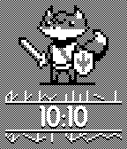
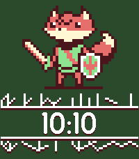

# Pebble-TUNIC

A watchface for the Pebble Smartwatch inspired by the 2022 videogame TUNIC by
Isometricorp Games.

## Screenshots

| Aplite/Diorite/Flint                                 | Basalt                                | Chalk                                  | Emery                               |
| ---------------------------------------------------- | ------------------------------------  | -------------------------------------- | ----------------------------------- |
|  |  |     |  |

## Installing

Coming soon to the Rebble Store.

## Dependencies

* Pebble SDK

## Building & Installing from Source

### Building

```
pebble build
```

### Installing

#### Pebble SDK Emulator

```
pebble install --emulator [PLATFORM]
```

#### Phone/Watch

```
pebble install --phone [PHONE_IP_ADDRESS]
```

## Generating Screenshots

```
./GenerateScreenshots.sh
```

## Acknowledgements

Fox pixel art created by [Wingedyeti](http://wingedyeti.com/).

## License

Copyright (C) 2026 Javier Rizzo-Aguirre

This program is free software: you can redistribute it and/or modify it under the terms of the GNU General Public License as published by the Free Software Foundation, either version 3 of the License, or (at your option) any later version.

This program is distributed in the hope that it will be useful, but WITHOUT ANY WARRANTY; without even the implied warranty of MERCHANTABILITY or FITNESS FOR A PARTICULAR PURPOSE. See the GNU General Public License for more details.

You should have received a copy of the GNU General Public License along with this program. If not, see https://www.gnu.org/licenses/
